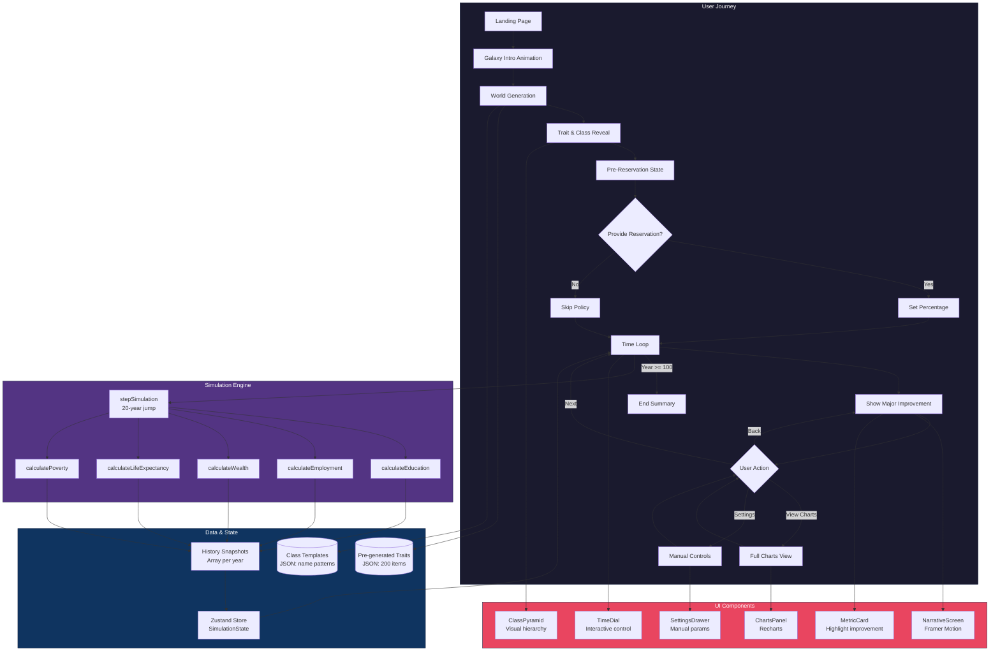

# Architecture: Reservation Simulator v2

## Intent

A story-driven single-page application that guides users through a satirical simulation of how reservation policies affect social stratification. The architecture prioritizes:

1. **Narrative UX** - Smooth transitions, dramatic reveals, emotional engagement
2. **Zero Runtime Dependencies** - Pre-generated content, no API calls
3. **Educational Accuracy** - Mathematical models grounded in research
4. **Mobile-First** - Responsive design, touch-friendly controls

## System Diagram




## Component Breakdown

### 1. User Flow Layer
| Component | Purpose | Key Tech |
|-----------|---------|----------|
| Landing Page | Entry point, "Start Simulation" CTA | Next.js page |
| Galaxy Intro | Animated text sequence | Framer Motion |
| World Generation | Pick random planet/nation/trait | Zustand + JSON data |
| Trait Reveal | Dramatic reveal of the "sacred difference" | Framer Motion |
| Pre-Reservation State | Show current inequality metrics | MetricCard components |
| Reservation Choice | User decides policy | Slider + buttons |
| Time Loop | Main simulation loop | State machine |
| Charts View | Full data visualization | Recharts |
| Settings | Manual parameter adjustment | Drawer component |

### 2. Data Layer
| Store | Contents | Format |
|-------|----------|--------|
| traits.json | 200 absurd differentiating traits | `{id, text, category}[]` |
| classTemplates.json | Name patterns for 5 classes | `{tier, patterns}[]` |
| Zustand Store | Current simulation state | In-memory |
| History | Array of YearSnapshot objects | In-memory |

### 3. Simulation Engine
Pure TypeScript functions with no side effects:

```typescript
// Core simulation step
function stepSimulation(
  state: SimulationState,
  years: number = 20
): SimulationState {
  let newState = { ...state };
  for (let y = 0; y < years; y++) {
    newState = applyYearlyChanges(newState);
    newState.history.push(captureSnapshot(newState));
    newState.currentYear++;
  }
  return newState;
}
```

### 4. UI Components
| Component | Props | State |
|-----------|-------|-------|
| NarrativeScreen | `text`, `onNext` | Animation state |
| TimeDial | `currentYear`, `onJump` | Rotation angle |
| MetricCard | `metric`, `before`, `after` | Highlight animation |
| ClassPyramid | `classes[]` | Hover state |
| ChartsPanel | `history[]`, `metrics[]` | Active metric, zoom |
| SettingsDrawer | `params`, `onChange` | Open/closed |

## Data Flow

```
User Action → Zustand Action → Simulation Engine → New State → React Re-render
                    ↓
              History Snapshot
                    ↓
              Charts Update
```

## File Structure

```
src/
├── app/
│   ├── page.tsx              # Landing
│   ├── simulate/
│   │   └── page.tsx          # Main simulation
│   └── layout.tsx
├── components/
│   ├── narrative/
│   │   ├── GalaxyIntro.tsx
│   │   ├── TraitReveal.tsx
│   │   └── TimeJump.tsx
│   ├── simulation/
│   │   ├── TimeDial.tsx
│   │   ├── MetricCard.tsx
│   │   ├── ClassPyramid.tsx
│   │   └── ReservationSlider.tsx
│   ├── charts/
│   │   ├── ChartsPanel.tsx
│   │   ├── WealthChart.tsx
│   │   ├── EducationChart.tsx
│   │   └── TimelineScrubber.tsx
│   └── ui/
│       ├── Button.tsx
│       ├── Drawer.tsx
│       └── ...
├── lib/
│   ├── simulation/
│   │   ├── engine.ts         # Core calculations
│   │   ├── models.ts         # Math formulas
│   │   └── types.ts
│   ├── content/
│   │   ├── traits.ts         # Load/pick traits
│   │   └── classNames.ts     # Generate class names
│   └── store/
│       └── simulation.ts     # Zustand store
├── data/
│   ├── traits.json           # 200 pre-generated traits
│   └── classTemplates.json   # Name patterns
└── styles/
    └── globals.css           # Tailwind + custom
```

## Review Notes

*Space for JD feedback on architecture decisions:*

- [ ] Confirm 5-class system vs simpler 3-4
- [ ] Review proposed tech stack
- [ ] Validate UX flow sequence
- [ ] Check absurd trait categories
