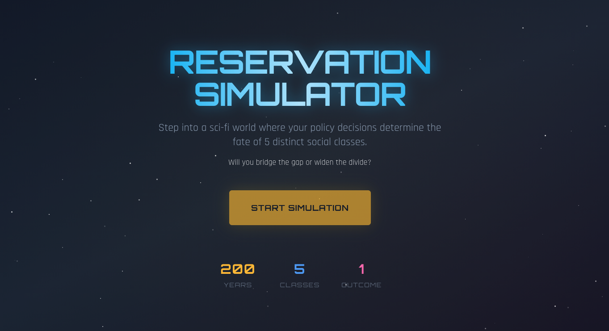

# Reservation Simulator



An interactive simulation exploring how reservation (affirmative action) policies shape socio-economic outcomes across hierarchically stratified social classes over 200 years.

## Live Demo

**[Try the Simulator](https://reservationsim.jdlabs.top)**

## Features

- **5 Social Classes**: Upper, Noble, Middle, Common, and Lower classes with distinct starting conditions
- **200-Year Timeline**: Watch policies compound across 5+ generations with 40-year decision intervals
- **6 Key Metrics**: Education, Employment, Wealth Distribution, Poverty, Life Expectancy, Income
- **Policy Controls**:
  - Reservation percentages (0-50%) for lower classes
  - Creamy Layer exclusions for affluent beneficiaries
  - EWS (Economically Weaker Sections) support for upper classes
- **Real-time Visualization**: Interactive charts showing class progression over time
- **Shareable Results**: Screenshot and share your simulation outcomes

## The Math

The simulation uses calibrated mathematical models based on India's 70-year reservation policy experience. Key formulas:

- **Education**: Gap-closing multiplier with generational compounding
- **Employment**: Education-to-employment pipeline with direct job quotas
- **Wealth**: Zero-sum redistribution normalized to 100%
- **Poverty**: Diminishing returns as poverty approaches floor
- **Life Expectancy**: Headroom-scaled gains from education and poverty reduction

For complete specifications, see the [Whitepaper](./whitepapers/Whitepaper.pdf).

## Tech Stack

- **Framework**: Next.js 14 (App Router)
- **Language**: TypeScript
- **Styling**: Tailwind CSS
- **Charts**: Recharts
- **Animation**: Framer Motion
- **State**: Zustand

## Development

```bash
# Install dependencies
npm install

# Run development server
npm run dev

# Build for production
npm run build

# Run tests
npm test
```

## Project Structure

```
src/
├── app/                    # Next.js app router pages
├── components/
│   ├── charts/            # Visualization components
│   ├── narrative/         # Story/intro screens
│   ├── policy/            # Policy control screens
│   ├── simulation/        # Core simulation UI
│   └── ui/                # Reusable UI components
├── lib/
│   ├── simulation/        # Core engine, models, types
│   └── store/             # Zustand state management
└── styles/                # Global styles
```

## License

MIT

## Author

Built by [@1nimit](https://x.com/1nimit)
